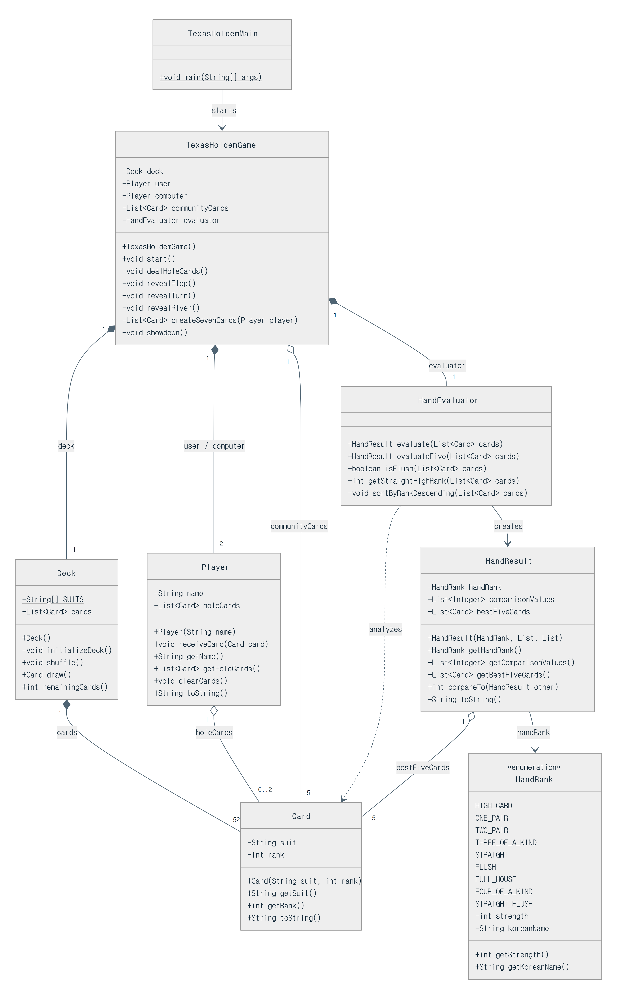

# Java Texas Hold'em Card Game

Java 수업에서 배운 클래스, 캡슐화, 컬렉션, 예외, `enum`, 인터페이스를 활용해 만드는
베팅 제외 2인용 텍사스 홀덤입니다. 기존 수업 코드는 보존하고 새 패키지
`src/hk/texasholdem`에서 별도로 구현했습니다.

> 이 저장소는 취업 아카데미 Java 과제로 제출한 결과물입니다. 수업 자료와 강사 코드는
> 포함하지 않고, 제가 직접 구현한 `hk.texasholdem` 패키지와 과제 문서만 분리해 담았습니다.
> 작업 과정은 [`PROMPT_LOG.md`](./PROMPT_LOG.md), 직접 잡은 버그와 수정 내역은
> [`CODE_REVIEW.md`](./CODE_REVIEW.md)에 있습니다.

## 한눈에 보기

|  |  |
| --- | --- |
| **무엇을 만들었나** | 베팅을 제외한 2인용(사용자 vs 컴퓨터) 텍사스 홀덤 콘솔 게임 |
| **왜 만들었나** | 취업 아카데미 Java 과제 — 클래스·캡슐화·컬렉션·예외·`enum`·인터페이스를 직접 써보기 위해 |
| **기간** | 2026년 8월 24일 ~ 8월 28일 |
| **환경** | Java 21, 외부 라이브러리 없음 (표준 라이브러리만 사용) |
| **규모** | 클래스 8개, 약 1,000줄 |
| **핵심 로직** | 개인 카드 2장 + 공용 카드 5장, 총 7장에서 21개 조합을 검사해 최강 5장 판정. 족보가 같으면 페어 숫자와 키커를 단계별로 비교 |
| **AI 활용 기록** | [PROMPT_LOG.md](./PROMPT_LOG.md) — 무엇을 물었고 프롬프트를 어떻게 고쳐갔는지 |
| **디버깅 기록** | [CODE_REVIEW.md](./CODE_REVIEW.md) — 직접 발견해 고친 설계 오류의 Before/After |

## 실행 화면

한 판이 진행되는 전체 흐름입니다. 카드 배분 → 플롭 → 턴 → 리버 → 쇼다운 → 승자 판정까지
콘솔에 출력됩니다. 족보뿐 아니라 **비교에 사용된 값(`비교값`)과 실제로 선택된 최강 5장**까지
함께 출력해, 판정 근거를 눈으로 확인할 수 있게 했습니다.

```text
==============================
간소화 텍사스 홀덤을 시작합니다.
==============================

내 개인 카드: [[◆3], [◆Q]]
컴퓨터 개인 카드: [비공개]

[플롭] 공용 카드 3장 공개
공용 카드: [[◆6], [◆8], [♣3]]

[턴] 공용 카드 1장 공개: [♠7]
공용 카드: [[◆6], [◆8], [♣3], [♠7]]

[리버] 공용 카드 1장 공개: [♣2]
공용 카드: [[◆6], [◆8], [♣3], [♠7], [♣2]]

==============================
쇼다운
==============================
사용자 개인 카드: [[◆3], [◆Q]]
컴퓨터 개인 카드: [[♣4], [♥9]]
공용 카드: [[◆6], [◆8], [♣3], [♠7], [♣2]]

사용자 족보: 원 페어 / 비교값: [3, 12, 8, 7] / 최종 카드: [[◆Q], [◆8], [♠7], [♣3], [◆3]]
컴퓨터 족보: 하이 카드 / 비교값: [9, 8, 7, 6, 4] / 최종 카드: [[♥9], [◆8], [♠7], [◆6], [♣4]]

최종 결과: 사용자 승리!
덱에 남은 카드: 43
```

위 출력에서 사용자는 공용 카드의 `◆3`과 개인 카드 `◆3`으로 원 페어가 완성됐고,
컴퓨터는 아무 조합도 만들지 못해 하이 카드로 남아 사용자가 이겼습니다.

## 구현 범위

- 조커 없는 카드 52장 생성 및 셔플
- 사용자와 컴퓨터의 개인 카드 2장 관리
- 포커 족보 9종 판정
- 같은 족보일 때 페어 숫자와 키커 비교
- 카드 7장 중 가능한 21개 조합을 검사해 최강 5장 선택
- 플롭·턴·리버 공개와 사용자·컴퓨터의 최종 승자 판정

베팅, 칩, 블라인드와 여러 라운드는 첫 구현 범위에서 제외했습니다. 현재는
`TexasHoldemGame`이 카드 배분부터 쇼다운과 승자 발표까지 한 판을 진행합니다.

## 주요 클래스

```text
Card
└─ 카드 한 장의 무늬와 숫자

Deck
└─ 카드 52장 생성, 셔플, 한 장 뽑기

Player
└─ 플레이어 이름과 개인 카드 2장 관리

HandRank
└─ 9가지 족보 이름과 강도

HandEvaluator
└─ 5장 족보 판정 및 7장 중 최강 5장 선택

HandResult
└─ 판정 결과 보관 및 다른 결과와 비교

TexasHoldemGame
└─ 개인 카드 배분, 공용 카드 공개, 쇼다운과 승자 발표

TexasHoldemMain
└─ 게임 객체를 만들고 한 판 시작
```

### 클래스 다이어그램



## 만든 과정

AI에게 "카드게임 만들어줘"라고 요청해 한 번에 받아낸 코드가 아닙니다. 클래스를 하나씩
직접 작성하고, 모르는 문법만 질문하고, 작성한 코드를 리뷰받아 고치는 사이클을
반복했습니다. 아래는 그 흐름의 요약이고, 프롬프트 전문과 AI 답변은
[`PROMPT_LOG.md`](./PROMPT_LOG.md)에 있습니다.

### 단계별로 무엇을 묻고 무엇을 직접 했나

| 단계 | AI에게 물어본 것 | 내가 판단하고 작성한 것 |
| --- | --- | --- |
| **1. 게임 선정·설계** | "52장으로 족보를 비교하는 게임이 무엇인가" (설계만, 구현은 요청하지 않음) | 텍사스 홀덤 확인 후 **베팅·칩·블라인드를 제외한 범위로 축소** 결정 |
| **2. 컬렉션** | `List`와 `ArrayList`의 관계, `Collections.shuffle()` 동작 | 수업 코드(`D2_CardCase`)의 랜덤 생성 + 중복 검사 방식 대신 **무늬 4 × 숫자 13 이중 반복문으로 52장 정확히 생성** |
| **3. 예외·캡슐화** | `IllegalStateException`, `unmodifiableList`가 왜 필요한지 | `Player`의 개인 카드 2장 제한 규칙과 내부 리스트 보호를 직접 구현 |
| **4. 족보 판정** | 7장에서 5장을 고르는 접근 방식 | **제외할 2장을 선택하는 21개 조합 루프**와 족보별 `comparisonValues` 순서를 직접 작성·검증 |

### 직접 발견해 고친 것

| 문제 | 원인 | 해결 |
| --- | --- | --- |
| `Card` 하나가 카드 한 장이 아니라 **전체 후보**를 들고 있었음 | 무늬 4개·숫자 13개 배열을 `Card`의 필드로 선언 | `Card`는 `final suit` / `final rank` 한 쌍만 갖고, 52장을 만드는 책임은 `Deck`으로 이동 ([사례 1](./CODE_REVIEW.md)) |
| 게임 클래스가 족보 계산까지 직접 수행 | 진행·판정·결과 비교의 책임이 한곳에 섞임 | `HandEvaluator`(판정) / `HandResult`(결과·비교) / `TexasHoldemGame`(진행)으로 분리 ([사례 2](./CODE_REVIEW.md)) |
| AI가 제안한 다이어그램에 **이번 범위에서 쓰지 않는 메서드**가 포함 | 일반적인 카드게임 기준의 설계 (`equals`, `hashCode`, `Deck.reset`) | 한 판만 실행하는 현재 흐름에 필요한 메서드만 남기고, **다이어그램도 구현에 맞춰 수정** |
| `HandResult`와 `HandEvaluator`의 역할을 혼동 | 비교할 때마다 족보 정보를 다시 넘겨야 하는지 헷갈림 | 실행 순서를 직접 추적해 `evaluateFive()` → 완성된 `HandResult` → `compareTo()` 흐름으로 정리 |

### 배운 것과 남은 과제

**배운 것**

- 한 클래스가 모든 일을 하면 왜 곤란해지는지를, 책임을 실제로 쪼개보며 이해했습니다.
- `Comparable`을 구현하면 `compareTo()` 하나로 비교·정렬이 되는 이유를 알게 됐습니다.
- 클래스 다이어그램은 고정된 정답이 아니라, 구현하면서 함께 고쳐 나가는 문서라는 걸
  경험했습니다.

**남은 과제**

- 베팅·칩·블라인드와 여러 라운드 진행
- 3인 이상 플레이어 지원
- 족보 판정 로직에 대한 단위 테스트 (현재는 콘솔 실행으로만 검증)

## 수업 코드 활용

- `D2_Card`, `D2_CardCase`: 카드 객체와 52장 목록이라는 기본 개념을 참고했습니다.
  기존의 랜덤 생성·중복 검사 대신 무늬 4개와 숫자 13개를 이중 반복문으로 정확히 만든
  후 `Collections.shuffle()`로 섞었습니다.
- 마방진 클래스 구조: 한 클래스가 모든 일을 하지 않고 생성, 판정, 실행 책임을
  분리하는 방식을 참고했습니다. 게임 종류가 하나뿐이므로 불필요한 Factory나 상속은
  추가하지 않았습니다.
- 수업의 인터페이스 개념을 `List`/`ArrayList`, `Comparable<HandResult>`에 연결해
  적용했습니다.

---

## 기여도 및 핵심 코드 명세서

### 1) 코드 기여도 구분

**[AI 도움을 받은 영역]**

- 텍사스 홀덤의 간소화 범위와 클래스 다이어그램 초안
- 클래스 구현 순서와 메서드 책임에 대한 설명
- `Collections.shuffle`, `unmodifiableList`, `IllegalStateException`, `enum`,
  `Comparable` 등 처음 접한 문법의 예제와 주석
- 작성한 파일의 읽기 검토, 별도 출력 폴더 컴파일 확인
- 요청 후 Main의 5장 테스트를 7장 테스트로 바꾼 통합 수정 1건

**[본인 직접 구현·검증한 영역]**

- `hk.texasholdem` 패키지와 Java 클래스 생성
- AI 설명을 이해한 뒤 각 클래스를 직접 입력하고 실행
- `Card` 배열 모델링 오류를 발견한 뒤 한 장의 상태로 수정
- 기존 수업 `D2_CardCase`와 비교해 52장 생성 방식을 결정
- `List`와 구현 클래스, 예외, 읽기 전용 리스트의 필요성을 재질문해 이해
- 족보별 `comparisonValues`의 순서를 확인하며 `HandEvaluator` 구현
- 7장 중 두 장을 제외하는 21가지 조합과 `compareTo()` 실행 흐름 검증
- 콘솔 카드 문양 문제와 Main 통합 테스트 결과 확인

전체 코드는 AI에게 한 번에 생성해 달라고 요청하지 않았습니다. 클래스 하나를 직접
작성하고 질문·실행·리뷰를 반복하는 방식으로 진행했습니다. 

### 2) 내가 직접 설명할 수 있는 핵심 코드

#### `HandEvaluator.evaluate()` — 7장 중 최강 5장 선택

```java
for (int firstExcluded = 0;
        firstExcluded < cards.size() - 1;
        firstExcluded++) {
    for (int secondExcluded = firstExcluded + 1;
            secondExcluded < cards.size();
            secondExcluded++) {

        List<Card> fiveCards = new ArrayList<>();

        for (int i = 0; i < cards.size(); i++) {
            if (i != firstExcluded && i != secondExcluded) {
                fiveCards.add(cards.get(i));
            }
        }

        HandResult currentResult = evaluateFive(fiveCards);

        if (bestResult == null
                || currentResult.compareTo(bestResult) > 0) {
            bestResult = currentResult;
        }
    }
}
```

7장 중 5장을 직접 선택하는 대신 제외할 2장을 선택합니다. 두 번째 인덱스를 첫 번째
인덱스 다음부터 시작해 `(0, 1)`과 `(1, 0)` 같은 중복을 막고 총 21개 조합을 만듭니다.
각 조합은 `evaluateFive()`로 먼저 완전한 `HandResult`가 된 후, 현재 최강 결과와
비교됩니다.

#### `HandResult.compareTo()` — 족보와 키커의 단계적 비교

```java
if (this.handRank.getStrength()
        > other.handRank.getStrength()) {
    return 1;
}
if (this.handRank.getStrength()
        < other.handRank.getStrength()) {
    return -1;
}

for (int i = 0; i < comparisonValues.size(); i++) {
    int thisValue = this.comparisonValues.get(i);
    int otherValue = other.comparisonValues.get(i);

    if (thisValue > otherValue) return 1;
    if (thisValue < otherValue) return -1;
}
return 0;
```

먼저 `HandRank` 강도로 서로 다른 족보의 승패를 결정합니다. 같은 족보일 때만
`comparisonValues`를 중요한 순서부터 비교합니다. 예를 들어 원 페어의 비교값은
`[페어 숫자, 높은 키커, 다음 키커, 마지막 키커]`이고, 모든 값까지 같을 때만
무승부인 `0`을 반환합니다.

## 실행 방법

JDK 17 이상이 필요합니다 (개발·검증 환경: JDK 21).

```bash
javac -encoding UTF-8 -d out src/hk/texasholdem/*.java
java -Dstdout.encoding=UTF-8 -cp out hk.texasholdem.TexasHoldemMain
```

`-encoding` / `-Dstdout.encoding` 옵션은 Windows 콘솔에서 카드 문양(`♠ ♥ ◆ ♣`)과 한글이
깨지지 않게 하기 위한 것입니다. IDE에서 실행할 때는 `hk.texasholdem.TexasHoldemMain`을
main 클래스로 지정하면 됩니다.

셔플 결과에 따라 매 실행마다 카드와 승자가 달라집니다.

## 프로젝트 구조

```text
java-texas-holdem/
├── src/hk/texasholdem/     # 구현 코드 (클래스 8개)
│   ├── Card.java           # 카드 한 장 (무늬 + 숫자)
│   ├── Deck.java           # 52장 생성, 셔플, 뽑기
│   ├── Player.java         # 플레이어와 개인 카드 2장
│   ├── HandRank.java       # 족보 9종 (enum)
│   ├── HandEvaluator.java  # 족보 판정, 7장 중 최강 5장 선택
│   ├── HandResult.java     # 판정 결과와 비교 (Comparable)
│   ├── TexasHoldemGame.java# 한 판 진행과 승자 발표
│   └── TexasHoldemMain.java# 진입점
├── docs/class-diagram.png  # 클래스 다이어그램
├── README.md               # 이 문서
├── PROMPT_LOG.md           # AI 프롬프트 일지
└── CODE_REVIEW.md          # 코드 리뷰 및 디버깅 일지
```
